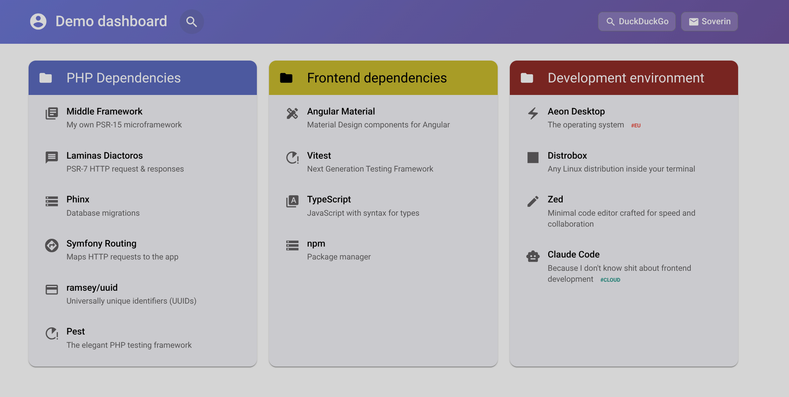
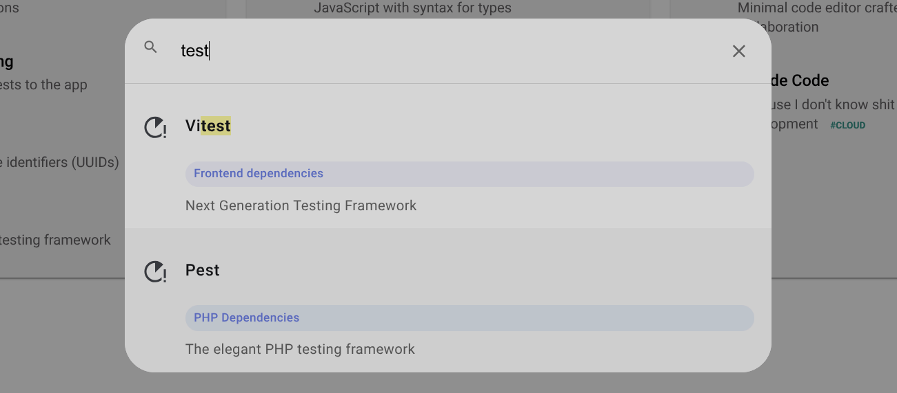
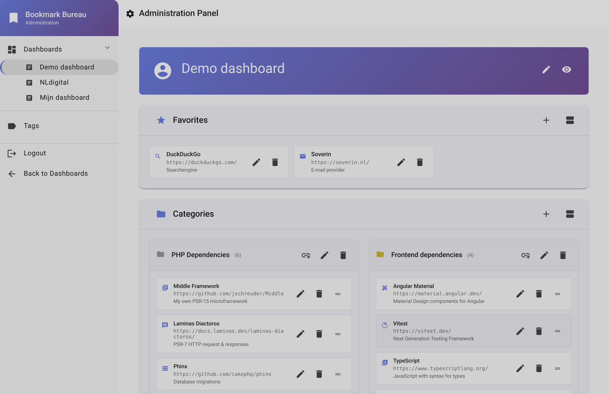

# BookmarkBureau

**A bookmark management system demonstrating clean architecture with [Middle Framework](https://github.com/jschreuder/Middle)**

[](https://github.com/jschreuder/BookmarkBureau/actions)
[](phpstan.neon)
[](https://github.com/jschreuder/BookmarkBureau/security/dependabot)
[](https://sonarcloud.io/dashboard?id=jschreuder_BookmarkBureau)
[](https://sonarcloud.io/dashboard?id=jschreuder_BookmarkBureau)
[](https://sonarcloud.io/dashboard?id=jschreuder_BookmarkBureau)
[](https://sonarcloud.io/dashboard?id=jschreuder_BookmarkBureau)

> ⚠️ **Development Status**: Getting very close to a 1.0 release.

## What is This?

BookmarkBureau is a real-world application demonstrating how to build production-quality APIs without magic:

- ✅ **Type-safe throughout** - Compile-time dependency injection with [Middle-DI](https://github.com/jschreuder/Middle-DI)
- ✅ **Clean architecture** - Action pattern, DDD principles, Repository pattern
- ✅ **Zero magic** - Explicit code, no hidden behavior, full IDE support
- ✅ **High quality** - SonarCloud Grade A ratings, comprehensive test coverage
- ✅ **Modern PHP** - PHP 8.4 features including property hooks

This demonstrates patterns, practices, and architecture that actually work.

## Screenshots

<table>
  <tr>
    <td width="33%" align="center">
      <a href="assets/dashboard-screenshot.png">
        
      </a>
      <br /><em>Dashboard View</em>
    </td>
    <td width="33%" align="center">
      <a href="assets/search-screenshot.png">
        
      </a>
      <br /><em>Search Functionality</em>
    </td>
    <td width="33%" align="center">
      <a href="assets/admin-screenshot.png">
        
      </a>
      <br /><em>Admin Panel</em>
    </td>
  </tr>
</table>

## Why Middle Framework?

### Coming from mainstream PHP frameworks?

Want compile-time safety instead of runtime errors? Clear patterns instead of magic? Architectural discipline instead of rapid prototyping?

```php
// Traditional PHP DI (runtime errors possible)
$service = $container->get('user.service');

// Middle-DI (compile-time safe, full IDE support)
$service = $container->getUserService();
```

### Coming from Go/Rust?

Want similar explicitness and type safety in PHP? Performance without complexity? Compiler-level guarantees?

**Middle brings these philosophies to PHP.**

## The Action Pattern

A layer built on top of the common Controller pattern, BookmarkBureau uses a three-phase action pattern throughout:

```php
// One line to wire up a complete CRUD operation
$router->post('/link', fn() => new ActionController(
    new LinkCreateAction(
        $container->getLinkService(),
        new LinkInputSpec(),
        new LinkOutputSpec()
    ),
    new JsonResponseTransformer()
));
```

Each action follows the same clear pattern:

```php
final readonly class LinkCreateAction implements ActionInterface
{
    // 1. Filter: Sanitize raw input (never throws)
    public function filter(array $rawData): array
    {
        return $this->inputSpec->filter($rawData);
    }

    // 2. Validate: Check constraints (throws on invalid)
    public function validate(array $data): void
    {
        $this->inputSpec->validate($data);
    }

    // 3. Execute: Perform the operation (transactional)
    public function execute(array $data): array
    {
        $link = $this->linkService->createLink(...);
        return $this->outputSpec->transform($link);
    }
}
```

**Result**: 30 lines of clear, testable code. No magic. Full type safety. Any developer can add new entities following this exact pattern.

## Current Features

### Implemented Entities

- **Dashboards** - Container for organizing bookmarks
- **Categories** - Grouped collections within dashboards
- **Links** - Individual bookmarks with metadata
- **Favorites** - Quick-access links per dashboard
- **Tags** - Labels for organizing links

### API Operations

All entities have complete CRUD operations:

```
POST   /dashboard              Create dashboard
PUT    /dashboard/{id}         Update dashboard
DELETE /dashboard/{id}         Delete dashboard

POST   /category               Create category
GET    /category/{id}          Read category
PUT    /category/{id}          Update category
DELETE /category/{id}          Delete category

POST   /link                   Create link
GET    /link/{id}              Read link
PUT    /link/{id}              Update link
DELETE /link/{id}              Delete link

POST   /dashboard/{id}/favorites       Add favorite
DELETE /dashboard/{id}/favorites       Remove favorite
PUT    /dashboard/{id}/favorites       Reorder favorites
```

### Architecture Highlights

**Action Layer**
- Consistent three-phase pattern (filter/validate/execute)
- InputSpec/OutputSpec for HTTP boundaries
- Zero coupling to HTTP framework

**Service Layer**
- Business logic coordination
- Flexible extension via OperationPipeline for cross-cutting concerns (transactions, logging, auditing)
- Clean interfaces for testing

**Repository Layer**
- PDO-based implementations, but interface-first and thus easily replaceable
- File-based alternatives for specific use cases (UserRepository, JwtJtiRepository)
- Entity mappers handle database in/out translation
- Cross-database compatible (MySQL/SQLite/PostgreSQL)
- Optimized queries, N+1 prevention

**Configuration & DI**
- Pure PHP configuration interfaces and implementations (no YAML/XML)
- Trait-based service container composition for modularity
- Compile-time type safety throughout

#### Domain Model Architecture

BookmarkBureau's domain layer is built on three complementary abstractions:

**Entity** → Domain objects with identity and lifecycle  
Examples: `User`, `Link`, `Dashboard`, `Category`  
- Mutable within transactions
- Identity is based on ID property
- Rich behaviors possible through methods
- Properties publicly accessible, but limitations possible using readonly & PHP 8.4 property hooks

**Value** → Immutable domain values without identity  
Examples: `Url`, `Title`, `HexColor`, `Icon`, `TagName`  
- Identity is based on full content
- Self-validating basic structure on construction (only formatting)
- Read only, cannot be changed after creation
- Fail-fast validation prevents invalid states

**Composite** → Type-safe compositions of entities and values  
Examples: `LinkCollection`, `CategoryWithLinks`, `DashboardWithCategoriesAndFavorites`  
- Readonly structures for returning complex data from services or repositories
- Built from domain language, not database concerns
- Aggregates for heterogeneous compositions
- Collections are a subtype for homogeneous groups

```php
// Entity: mutable within transactions, identity-based
$link = new Link($linkId, $url, $title, ...);
$link->url = new Url('https://updated.example');

// Value: immutable, self-validating, structural equality
$url = new Url('https://example.com'); // Throws if invalid

// Composite: readonly aggregation for specific use cases
$view = new CategoryWithLinks($category, $links);
```

This three-pillar approach creates a complete domain language: Entities represent your business concepts, Values ensure correctness, and Composites provide type-safe data structures. Together they enable compile-time safety while remaining framework-agnostic and testable.

## Quick Start

### Docker (Recommended)

**Requirements**: Docker or Podman

```bash
# Using Docker
docker run -d \
  --name bookmarkbureau \
  -p 8080:8080 \
  -v bb-data:/var/www/var \
  -e JWT_SECRET=$(openssl rand -hex 32) \
  -e SITE_URL=http://localhost:8080/api.php \
  ghcr.io/jschreuder/bookmark-bureau:latest

# Using Podman (rootless)
podman run -d \
  --name bookmarkbureau \
  -p 8080:8080 \
  -v bb-data:/var/www/var \
  -e JWT_SECRET=$(openssl rand -hex 32) \
  -e SITE_URL=http://localhost:8080/api.php \
  ghcr.io/jschreuder/bookmark-bureau:latest

# Using docker-compose
curl -O https://raw.githubusercontent.com/jschreuder/BookmarkBureau/master/docker-compose.yml
# Edit JWT_SECRET in docker-compose.yml
docker-compose up -d
```

**Environment Variables**:
- `JWT_SECRET` (required) - Secret key for JWT tokens (use a secure random value)
- `SITE_URL` (optional) - Base URL including `/api.php`, default: `http://localhost:8080/api.php`
- `SESSION_TTL` (optional) - Session timeout in seconds, default: `1800` (30 min)
- `TRUST_PROXY_HEADERS` (optional) - Trust X-Forwarded-For headers, default: `false` (set to `true` when behind reverse proxy)
- `ADMIN_IP_WHITELIST` (optional) - Comma-separated IPs/CIDR ranges allowed to access admin routes, default: empty (all IPs allowed)
  - Example: `ADMIN_IP_WHITELIST=192.168.1.0/24,10.0.0.5` restricts to local network only
  - Public routes (login, dashboard view) are always accessible regardless of whitelist

Access the application at `http://localhost:8080`

### Security Considerations for Internet Exposure

**Important**: This is a demonstration project. Before exposing to the internet:

1. **Behind Reverse Proxy (Required)**
   - Deploy behind a reverse proxy (nginx, Caddy, Synology NAS, etc.)
   - Enable HTTPS at the reverse proxy level
   - Set `TRUST_PROXY_HEADERS=true` when behind a trusted reverse proxy
   - Ensure reverse proxy adds `X-Forwarded-For` headers for proper rate limiting

2. **JWT Secret (Critical)**
   - Generate a secure random secret: `openssl rand -hex 32`
   - Never use the default `change-me-in-production` value
   - Store securely (environment variable or secrets manager)

3. **Known Limitations**
   - No multi-user authorization (all authenticated users can modify all data)
   - Rate limiting only on login endpoints (no API endpoint throttling)
   - SQLite is used (suitable for personal use, not high-traffic scenarios)
   - Session tokens valid until expiry (30 min default, no server-side revocation except JTI blacklist)

4. **IP Whitelisting (Recommended for Internet Exposure)**
   - Restrict admin access to your local network or specific IPs
   - Example: `ADMIN_IP_WHITELIST=192.168.1.0/24` (allows only local network)
   - Supports CIDR notation and multiple ranges: `192.168.1.0/24,10.0.0.5,2001:db8::/64`
   - Public routes (login, dashboard view) remain accessible from anywhere
   - Requires `TRUST_PROXY_HEADERS=true` when behind reverse proxy

5. **Recommended Additional Protections**
   - Configure firewall rules at NAS/router level
   - Use fail2ban or similar for additional brute-force protection
   - Monitor logs regularly (`/var/www/var/logs/`)
   - Keep Docker images updated

**For personal/demonstration use only. Not recommended for multi-user production environments.**

### Local Development

**Requirements**: PHP 8.4+, Composer, MySQL 8.0+ or SQLite

```bash
git clone https://github.com/jschreuder/BookmarkBureau.git
cd BookmarkBureau
composer install
cp config/dev.php.example config/dev.php
# Edit config/dev.php with your database credentials
vendor/bin/phinx migrate
```

**Run Development Server**:

```bash
php -S localhost:8080 -t web
```

### Example API Calls

```bash
# Create a dashboard
curl -X POST http://localhost:8080/dashboard \
  -H "Content-Type: application/json" \
  -d '{"title":"My Dashboard","description":"Personal bookmarks","icon":"🏠"}'

# Create a link
curl -X POST http://localhost:8080/link \
  -H "Content-Type: application/json" \
  -d '{"url":"https://example.com","title":"Example","description":"A site","icon":"🔗"}'

# Get a link
curl http://localhost:8080/link/{id}
```

## Project Structure

```
/src
  /Action              CRUD operations following three-phase pattern
  /Command             CLI commands for application management
  /Composite           Immutable data structures composing entities/values
  /Config              Configuration interfaces and implementations
  /Controller          HTTP controllers (generic ActionController)
  /Entity              Domain entities with value objects
    /Mapper            Entity-to-database mapping layer
  /Exception           Custom exception hierarchy
  /HttpMiddleware      PSR-15 HTTP middleware components
  /InputSpec           Request filtering and validation
  /OperationMiddleware Transaction/logging middleware for service operations
  /OperationPipeline   Pipeline system for cross-cutting concerns
  /OutputSpec          Response serialization
  /Repository          Data access layer (interfaces + PDO/file-based)
  /Response            Response transformers (JSON, etc.)
  /Service             Business logic coordination
  /ServiceContainer    DI container trait-based composition
  /Util                Shared utilities (SqlBuilder, Filter, etc.)

  *RoutingProvider.php Route registration by domain area

/migrations            Database migrations
/web                   Application entry point
/config                Configuration files
```

## Framework Comparison

### vs Magic & Conventions

```php
// Those using facades: magic methods, runtime resolution, hidden dependencies
$user = User::find($id);
Route::resource('products', ProductController::class);

// Middle: Explicit code, compile-time safety, dependency inversion
$user = $this->userRepository->findById($userId);
$router->post('/products', fn() => new ActionController(...));
```

**Middle wins on**: Type safety, explicitness, testability
**Magic/conventions wins on**: Speed of development, ecosystem

### vs Configuration Heavy

```yaml
# Those using YAML/XML configuration
services:
  App\Service\UserService:
    arguments: ['@doctrine.orm.entity_manager']
```

```php
// Middle: Zero configuration, just PHP
public function getUserService(): UserService
{
    return new UserService($this->getEntityManager());
}
```

**Middle wins on**: Zero config, IDE support, simplicity
**Configuration-heavy wins on**: Enterprise features, maturity

### vs Pure Microframework

```php
// Microframework: Minimal structure, bring everything yourself
$app->post('/products', function ($request, $response) {
    // You build everything from scratch
});
```

```php
// Middle: Patterns provided, structure included
$router->post('/products', fn() => new ActionController(
    new ProductCreateAction(...), // Clear pattern to follow
    new JsonResponseTransformer()
));
```

**Middle wins on**: Architectural patterns, DI, structure
**Microframework wins on**: Pure minimalism, flexibility

## Learn More

- [Middle Framework](https://github.com/jschreuder/Middle) - PSR-15 routing & middleware
- [Middle-DI](https://github.com/jschreuder/Middle-DI) - Compile-time dependency injection
- [MiddleAuth](https://github.com/jschreuder/MiddleAuth) - ACL/RBAC/ABAC authorization

## Contributing

This project primarily serves as a demonstration of Middle Framework patterns. However, contributions that improve the demonstration value or application quality are welcome.

## License

MIT

---

**Built with discipline. Designed for maintainability. Proven patterns for production.**
